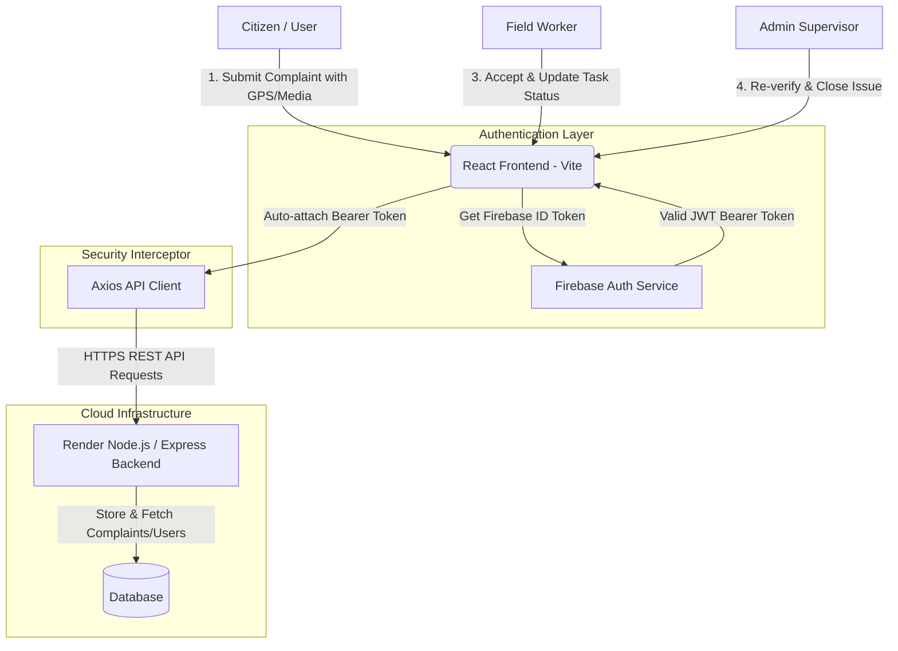
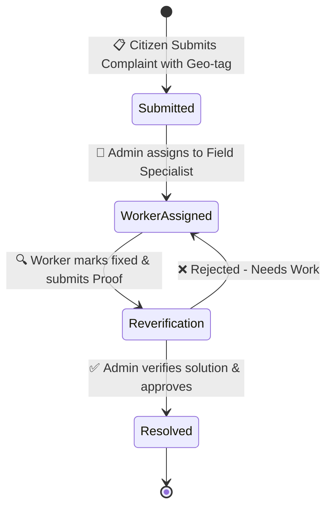

<div align="center">

  # ⚡ SamaDhan — Next-Gen Civic Issue & Grievance Portal

  <p align="center">
    <b>Empowering Communities • Streamlining Resolutions • Transforming Civic Governance</b>
  </p>

  <p align="center">
    A state-of-the-art, full-stack civic infrastructure management and complaint resolution platform built with <b>React 18</b>, <b>Vite</b>, <b>Firebase Auth</b>, and <b>Framer Motion</b>.
  </p>

  <p align="center">
    <a href="https://ram-final-backend-1.onrender.com/"></a>
    <a href="https://reactjs.org/"></a>
    <a href="https://vitejs.dev/"></a>
    <a href="https://firebase.google.com/"></a>
    <a href="https://www.framer.com/motion/"></a>
    <a href="https://netlify.com/"></a>
  </p>

  <br />

  ---

</div>

<details>
  <summary><b>📖 Table of Contents</b> (Click to expand)</summary>
  
- [✨ Key Features](#-key-features)
- [🏗️ System Architecture](#️-system-architecture)
- [🔄 Complaint Resolution Lifecycle](#-complaint-resolution-lifecycle)
- [⚙️ Tech Stack & Ecosystem](#️-tech-stack--ecosystem)
- [👥 Role-Based Access Matrix](#-role-based-access-matrix)
- [📁 Directory Structure](#-directory-structure)
- [🚀 Quick Start Guide](#-quick-start-guide)
- [🔐 Environment Variables](#-environment-variables)
- [🌐 Deployment](#-deployment)
- [🤝 Contributing](#-contributing)
- [📄 License](#-license)
</details>

---

## ✨ Key Features

| Feature | Description | Target Audience |
| :--- | :--- | :--- |
| **🌐 Multi-Role Dashboards** | Custom-tailored portals for Citizens, Field Workers, and Super Admins. | All Users |
| **📍 Geo-Tagging & Mapping** | Precise GPS location attachment and interactive map visualizer for issues. | Citizens & Workers |
| **📊 Real-Time Progress Tracker** | Dynamic, animated 4-stage resolution stepper with live status updates. | Citizens |
| **🔍 Admin Verification Pipeline** | Multi-tier validation system ensuring issues are truly resolved before closure. | Admins |
| **🌍 Multi-Lingual Support (i18n)** | Seamless internationalization for diverse regional communities. | All Users |
| **🔐 Secure Firebase & JWT Auth** | Automated token injection interceptor ensuring encrypted, authorized API requests. | System |
| **✨ Glassmorphic UI/UX** | Modern aesthetic with fluid Framer Motion animations and responsive dark elements. | All Users |

---

## 🏗️ System Architecture



---

## 🔄 Complaint Resolution Lifecycle

Every submitted grievance undergoes a transparent, verifiable 4-stage progression:



1. **Submitted 📋**: Issue recorded with coordinates, description, and category.
2. **Worker Assigned 👷**: Dispatched to the nearest qualified field team.
3. **Re-verification 🔍**: Work completed by field worker, under quality inspection.
4. **Resolved ✅**: Admin verifies resolution and citizen is notified.

---

## ⚙️ Tech Stack & Ecosystem

### **Frontend Core**
- **Framework**: [React 18](https://reactjs.org/) + [Vite 5](https://vitejs.dev/)
- **State & Router**: React Context API, React Router DOM
- **Animations**: [Framer Motion](https://www.framer.com/motion/)
- **Icons**: [Lucide React](https://lucide.dev/)
- **Internationalization**: `react-i18next` / `i18next`

### **Backend & Authentication**
- **Auth Provider**: Firebase Authentication (ID Tokens & OAuth)
- **HTTP Client**: Axios with custom interceptors for JWT Bearer Tokens
- **API Endpoint**: Hosted on Render (`ram-final-backend-1.onrender.com`)

### **Tooling & Styling**
- **CSS**: Custom Design System with CSS Custom Properties, Glassmorphism, and Flex/Grid layouts
- **Code Quality**: ESLint 9
- **Deployment**: Netlify (`netlify.toml` single-page routing configuration)

---

## 👥 Role-Based Access Matrix

| Feature / Action | Citizen / User | Field Worker | Admin Supervisor |
| :--- | :---: | :---: | :---: |
| **Raise New Complaint** | ✅ | ❌ | ❌ |
| **View Personal Complaints & Tracker** | ✅ | ❌ | ❌ |
| **View Assigned Tasks & Route Map** | ❌ | ✅ | ❌ |
| **Update Work Progress & Upload Proof** | ❌ | ✅ | ❌ |
| **Global Complaints Control Center** | ❌ | ❌ | ✅ |
| **Assign / Reassign Workers** | ❌ | ❌ | ✅ |
| **Final Re-verification & Approval** | ❌ | ❌ | ✅ |
| **Worker Management & System Analytics** | ❌ | ❌ | ✅ |

---

## 📁 Directory Structure

```text
ram_final_frontend/
├── public/                  # Static assets & icons
│   ├── favicon.svg
│   └── icons.svg
├── src/
│   ├── assets/              # Branding images & SVG vectors
│   ├── components/          # Reusable UI components
│   │   ├── admin/           # Admin Dashboard views (Overview, Complaints, Workers)
│   │   ├── user/            # User Dashboard views (MyComplaints, RaiseComplaint, Profile)
│   │   ├── LanguageSwitcher.jsx
│   │   └── ProtectedRoute.jsx
│   ├── context/             # React Auth & State Contexts
│   ├── pages/               # Top-level page routes
│   │   ├── admin/           # Admin Dashboard Page
│   │   ├── user/            # User Dashboard Page
│   │   ├── worker/          # Worker Dashboard Page
│   │   ├── LandingPage.jsx
│   │   ├── LoginPage.jsx
│   │   └── RegisterPage.jsx
│   ├── utils/               # Geolocation & Avatar helpers
│   ├── api.js               # Central Axios client with Firebase JWT Interceptor
│   ├── firebase.js          # Firebase SDK Initialization
│   ├── i18n.js              # Localization config
│   ├── main.jsx             # React DOM root entry
│   └── index.css            # Global CSS design tokens
├── netlify.toml             # Netlify SPA redirect rules
├── vite.config.js           # Vite build system configuration
└── package.json             # Project metadata & dependencies
```

---

## 🚀 Quick Start Guide

### Prerequisites
- **Node.js** `>= 18.x`
- **npm** `>= 9.x`

### 1. Clone the Repository
```bash
git clone https://github.com/CoderAnimesh/Ram_Final.git
cd Ram_Final
```

### 2. Install Dependencies
```bash
npm install
```

### 3. Configure Environment
Create a `.env` file in the root directory and add your Firebase credentials:
```env
VITE_FIREBASE_API_KEY=your_api_key_here
VITE_FIREBASE_AUTH_DOMAIN=your_project.firebaseapp.com
VITE_FIREBASE_PROJECT_ID=your_project_id
VITE_FIREBASE_STORAGE_BUCKET=your_project.appspot.com
VITE_FIREBASE_MESSAGING_SENDER_ID=your_sender_id
VITE_FIREBASE_APP_ID=your_app_id
VITE_API_BASE_URL=https://ram-final-backend-1.onrender.com/
```

### 4. Run Development Server
```bash
npm run dev
```
Open your browser and navigate to `http://localhost:5173`.

### 5. Build for Production
```bash
npm run build
```

---

## 🔐 Environment Variables

| Variable | Description | Required |
| :--- | :--- | :---: |
| `VITE_FIREBASE_API_KEY` | Firebase Web API Key | Yes |
| `VITE_FIREBASE_AUTH_DOMAIN` | Firebase Authentication Domain | Yes |
| `VITE_FIREBASE_PROJECT_ID` | Firebase Project Identifier | Yes |
| `VITE_API_BASE_URL` | Express Backend URL Endpoint | Yes |

---

## 🌐 Deployment

The repository includes pre-configured production deployment settings for **Netlify**:

```toml
# netlify.toml
[build]
  publish = "dist"
  command = "npm run build"

[[redirects]]
  from = "/*"
  to = "/index.html"
  status = 200
```

---

## 🤝 Contributing

Contributions make the open-source community an incredible place to learn, inspire, and create. Any contributions you make are **greatly appreciated**!

1. Fork the Project
2. Create your Feature Branch (`git checkout -b feature/AmazingFeature`)
3. Commit your Changes (`git commit -m 'Add some AmazingFeature'`)
4. Push to the Branch (`git checkout -b feature/AmazingFeature`)
5. Open a Pull Request

<p align="center">
  <a href="https://github.com/CoderAnimesh/Ram_Final/graphs/contributors">
    
  </a>
</p>

---

## 📄 License

Distributed under the **MIT License**. See `LICENSE` for more information.

---

<div align="center">
  <sub>Built with ❤️ for better civic infrastructure and smarter communities.</sub>
</div>
